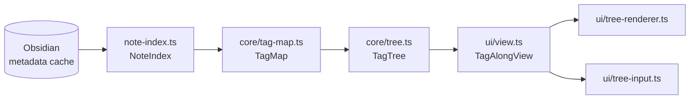

# Architecture

Tag Along is a view over the tags in your vault. It keeps no state of its own
apart from its settings and which folders are open, and its folders are worked
out from the notes every time something changes.

## Layers

| Path | What it holds |
| --- | --- |
| `src/core/` | Every rule about the tree. Pure: no Obsidian imports, so it is tested with plain objects. |
| `src/note-index.ts` | Reads each Markdown note's tags and display name from Obsidian's metadata cache, and keeps them current. |
| `src/settings.ts` | The settings shape, defaults, validation and migrations. See [Settings](settings.md). |
| `src/main.ts` | The plugin: registers the view, commands and events, and owns the one tree all views share. |
| `src/host.ts` | `PluginHost`, the part of the plugin the view and menus get to see. |
| `src/ui/` | The pane, its rows, menus, drag and drop, renaming and the settings tab. |
| `src/tag-clicks.ts` | Opens a tag's folder when you click a tag in a note, if that setting is on. |
| `src/rename.ts` | Renames a note from the tree, title and file. |

## Core

| File | What it decides |
| --- | --- |
| `tags.ts` | What a tag is: normalising, namespaces, which notes are in scope, a note's display title. |
| `tag-map.ts` | Which tags each note has *in the tree*, after hidden, exclusive and top-level folders are applied. |
| `tree.ts` | The folders: grouping, compacting, filter folders, flat folders, ordering. See [Tree model](tree-model.md). |
| `sort.ts` | The note and folder sort orders. |
| `reorder.ts` | Where a folder lands when you drag it. |
| `keyboard.ts` | Where the arrow keys move the focus. |
| `select.ts` | Which notes a Shift-click selects. |
| `paths.ts` | Keeping folder settings correct when a vault folder is renamed or differs in case. |
| `cache.ts` | `LastResult`, which reuses a computation while its inputs stay the same. |

Every file in `core/` has a test of the same name in `tests/`, and so does
`settings.ts`. Nothing in `ui/` has one, so a rule that ends up there is in the
wrong place.

## From a change in the vault to the tree

1. **The index notices.** `main.ts` listens to the metadata cache's `changed`
   event, and to the vault's `rename` and `delete`. `NoteIndex.update` re-reads
   one note and bumps its `version` only when something the tree shows has
   changed: the tags, the display name, or a date when the tree is sorted by
   date. Typing in a note without changing its tags doesn't redraw anything.
2. **The tree is rebuilt once.** `plugin.tree()` goes through `LastResult`,
   keyed on the index version and the settings object. All open panes share the
   same `TagTree`, so it's built once per change, not once per pane.
3. **The panes redraw.** `refreshViews` is debounced by 100 ms, so a burst of
   changes, such as a sync, redraws once.

A renamed or deleted vault folder rebuilds the whole index, because Obsidian
doesn't always send an event for each note inside it.

## Building the tree

`TagTree` is built lazily:

- The constructor builds `TagMap` and an index of the whole tree (`notesUnder`,
  `subfolders`, `notesDirectlyIn`) in one pass over the notes.
- `root()` works out the top level.
- `children(node)` works out one folder the first time it's opened, and caches
  it. Filter folders are only computed when their parent opens.

So opening a folder in a vault of 20,000 notes is a lookup, not a scan. See
[Performance](performance.md).

## Settings changes

`updateSettings` takes a patch or a function of the current settings, runs it
through `migrateSettings` so every value is validated, and only saves and
redraws when the result differs. Turning **Show note titles** on or off rebuilds
the index, because display names live there.

`onExternalSettingsChange` reloads `data.json` when a sync service changes it.

## What is stored

- **Settings:** `data.json`, through `saveData`.
- **Open folders:** per pane, in the view state (`getState` and `setState`),
  saved with Obsidian's workspace layout. A folder is remembered by its key,
  the chain of tags that leads to it.
- Nothing else. The tree is never written anywhere.
